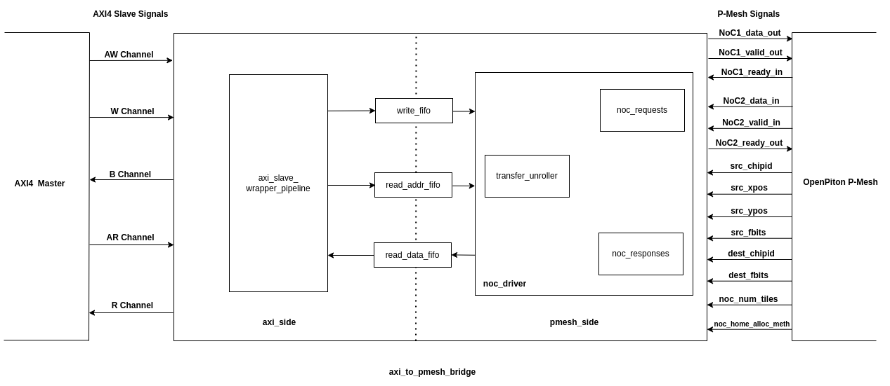
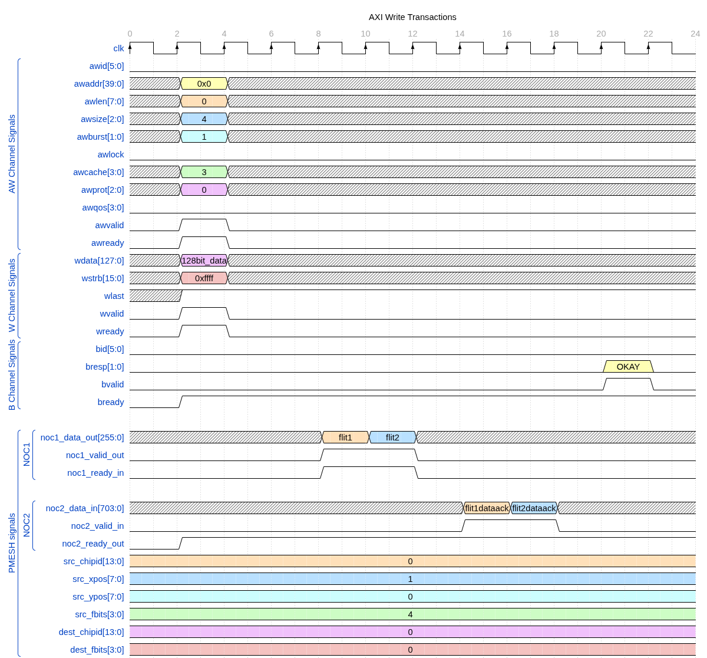
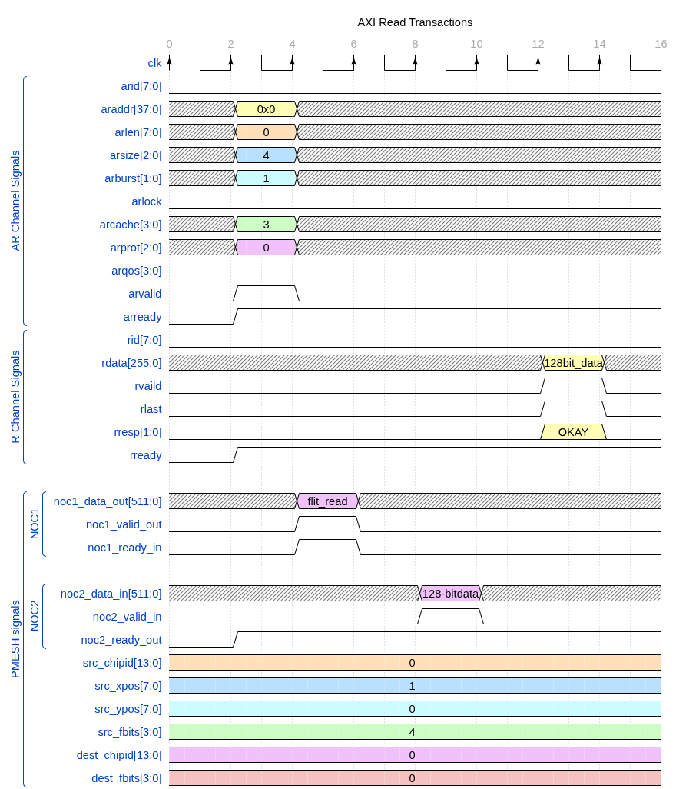
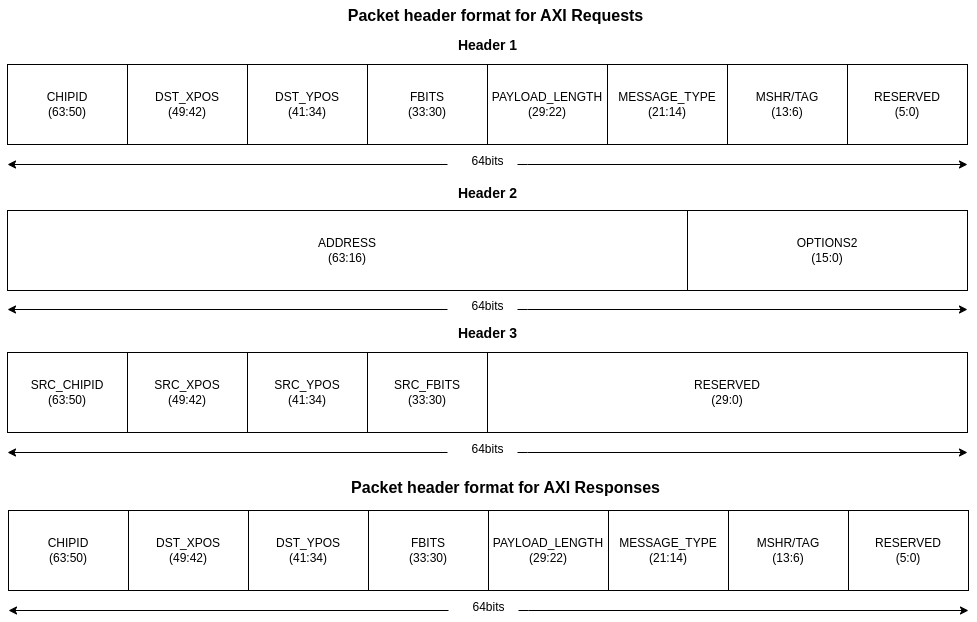
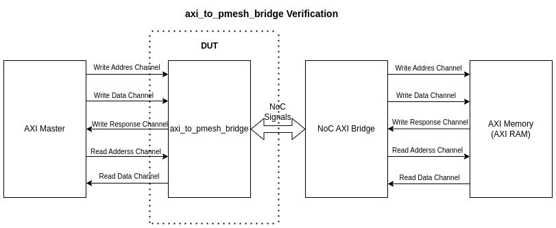

<div align="center">

# AXI_to_PMESH_Bridge

</div>

AXI_to_PMESH_Bridge is responsible for converting peripheral AXI transactions into NoC packets. These NoC packets play an important role in coherent access to OpenPiton memory hierarchy.

This repository consists of all design modules and testbench modules of the AXI_to_PMESH_Bridge. 

## Table of Contents 

- **[1 About](#1-about)**
- **[2 Getting Started](#2-getting-started)**
    - **[2.1 Installation](#21-installation)**
    - **[2.2 Example](#22-example)**
        - **[2.2.1 Usage](#221-usage)**
        - **[2.2.2 Verification of example](#222-verification-of-example)**
- **[3 RTL Linting using VC SpyGlass](#3-rtl-linting-using-vc-spyglass)**
- **[4 Licensing](#4-licensing)**

## 1. About



AXI_to_PMESH_Bridge uses unique message types for load and store requests sent to the Last-Level Cache (in OpenPiton it is L2 cache). Some details about the message types are as follows: 

- **MSG_TYPE_LOAD_NOSHARE_REQ** - This message type is for coherent (cacheable) load requests sent to the Last-Level Cache. When a Noshare-Load request is initiated, the LLC responds by providing a coherent copy of the requested data.
- **MSG_TYPE_SWAPWB_REQ** - This message type is for coherent (cacheable) store requests sent to the Last-Level Cache. This operation is implemented similarly to the atomic operation in OpenPiton, ensuring system synchronization.
- **MSG_TYPE_NC_LOAD_REQ** - This message type is for non-coherent (non-cacheable) load requests sent to the Last-Level Cache. A non-cacheable Load is forwarded to its final destination and the LLC responds by providing a non-coherent copy of the requested data.
- **MSG_TYPE_NC_STORE_REQ** - This message type is for non-coherent (non-cacheable) store requests sent to the Last-Level Cache. A non-cacheable store is forwarded to its final destination.

## 2. Getting Started

### 2.1 Installation

To download the repository :

```
git clone https://gitlab.bsc.es/hwdesign/rtl/uncore/pmesh_utils/axi_to_pmesh_bridge.git

cd axi_to_pmesh_bridge/

```

### 2.2 Example

The following example shows how to use AXI_to_PMESH_Bridge in the OpenPiton framework and it is followed by verifying the same.

#### 2.2.1 Usage

##### AXI Write request: 

From the waveform diagram added below: 

For each AXI write request when size of each transfer is 16 bytes (8 bytes * 2), on the NoC1 2flits can be observed. Each flit consists of :

- flit1 : 1st_8byte_swap + Header_3 + Header_2 + Header_1
- flit2 : 2nd_8byte_swap

Note : 

1. Our work focuses to perform AXI write requests where each transfer size is 16 bytes.

2. The **MSG_TYPE_SWAPWB_REQ**  supports up to 16 bytes, limited by the OpenPiton Last Level Cache (LLC). Additionally, **MSG_TYPE_NC_STORE_REQ** supports up to 8 bytes, limited by the OpenPiton Last Level Cache (LLC).

3. As 16 bytes can be divided in chunks of 2-8 bytes -> 1st and 2nd. 1st_8byte_swap means 1st 8 bytes of the 16 bytes data is swapped. Similarly follows for 2nd 8 bytes.

4. Header_1, Header_2 and Header_3 can be known in detail from the referring OpenPiton Microarchitecture document (https://parallel.princeton.edu/openpiton/docs/micro_arch.pdf)

For each AXI write request when size of each transfer is more than 16 bytes which is '8 bytes * n', on the NoC1 'n' flits can be observed. Each flit consists of :

- flit1     : 1st_8byte_swap + Header_3 + Header_2 + Header_1
- flit2     : 2nd_8byte_swap
- flit(n-1) : (n-1)th_8byte_swap + Header_3 + Header_2 + Header_1
- flitn     : nth_8byte_swap

##### AXI write response : 

For each cacheable write request an acknowledgement is received on NoC2. Here, **MSG_TYPE_DATA_ACK** is received on NoC2. The returned data is ignored. (This can be identified on decoding the flit information using the header flit format which is added below).

For each non-cacheable write request an acknowledgement is received on NoC2. Here, **MSG_TYPE_NODATA_ACK** is received on NoC2. (This can be identified on decoding the flit information using the header flit format which is added below).

For each AXI write transaction the AXI_to_PMESH_Bridge provides OKAY response indicating that transaction was successful. OKAY response is received after receiving the final acknowledgement from NoC2. 

<div align="center">



</div>

##### AXI Read request: 

For each AXI read request when size of each transfer is 16 bytes:

- Output of AXI_to_PMESH_Bridge  - 1 flit which consists of Header_3 + Header_2 + Header_1 on NoC1.

For each AXI read request when size of each transfer is more than 16 bytes, say n bytes:

- Output of AXI_to_PMESH_Bridge  - (n / 16) flit which consists of Header_3 + Header_2 + Header_1 with address being updated in Header_2 of each flit on NoC1.

##### AXI Read response :

For each cacheable/non-cacheable read request an acknowledgement along with data is received on NoC2. Here, **MSG_TYPE_DATA_ACK** acknowledgement is received along with data on NoC2. (This can be identified on decoding the flit information using the header flit format which is added below).

For each AXI read transaction the AXI_to_PMESH_Bridge provides OKAY response indicating that transaction has completed successfully, read data is valid.
 
<div align="center">



</div>

<div align="center">



</div>


Navigate to the openpiton directory : 

```
cd example/openpiton

```

Here, you can find the openpiton framework dependent files : 

- Header files in **include** directory
- Design files in **src** directory 


#### 2.2.2 Verification of example

<div align="center">



</div>

##### Pre-requisites

**Cocotb Setup :**

Make sure you have installed the following in your system: 

1. Python3.6+
2. GNU Make 3+

Using pip, cocotb and the necessary libraries can be installed by the following command : 

```
pip install cocotb

pip install cocotb-test

pip install cocotbext-axi

``` 

##### EDA Tool Support

Following Tools are supported : 

1. Verilator (v5.022/v5.024/v5.030)
2. Synopsys VCS
3. Siemens Questasim

##### AXI parameters Tested

Functionality of the AXI_to_PMESH Bridge is tested with specific AXI parameters as follows :

<pre>
AXI_DATA_WIDTH  = 128
AXI_ADDR_WIDTH  = 40
AXI_ID_WIDTH    = 6
AXI_CACHE_WIDTH = 4
AXI_LEN_WIDTH   = 8
AXI_BURST_WIDTH = 2
AXI_SIZE_WIDTH  = 3
AXI_RESP_WIDTH  = 2
AXI_WSTRB_WIDTH = 16
</pre>

##### NoC parameters Tested

Functionality of the AXI_to_PMESH Bridge is tested with specific NoC parameters as follows :

<pre>
PITON_NOC1_WIDTH 256
PITON_NOC2_WIDTH 704
PITON_NOC3_WIDTH 704
</pre>

##### Running tests

Navigate to the test directory :

```
cd example/openpiton/test

```
To run test and view waveform using verilator:

```
make SIM=verilator WAVES=1

```
```
gtkwave dump.vcd

```

To run test and view waveform using Synopsys VCS:

```
make SIM=vcs WAVES=1

```

To run test and view waveform using Siemens Questasim:

```
make SIM=questa WAVES=1

```

To run test with all possible noc_width:

Currently, the test checks for:  
For NOC1 : 64, 128, 192, 256, 320, 384, 448, 512, 576, 640, 704  
For NOC2 : 64, 128, 192, 256, 320, 704  
For NOC3 : 64, 128, 192, 256, 320, 384, 448, 512, 576, 640, 704  

```
python noc_width_test.py --sim=<verilator/vcs/questa>

```

##### Modifying the Tests

To know more about the test navigate to the test directory and open test_axi_to_pmesh_bridge.py

```
cd example/openpiton/test

vi test_axi_to_pmesh_bridge.py

```

To increase the number of bytes per transfer or number of transactions change the following in test_axi_to_pmesh_bridge.py

```
NUM_BYTES        = 32
NUM_TRANSACTIONS = 4

```
## 3. RTL Linting using VC SpyGlass

To run RTL Linting using VC SpyGlass

```
cd axi_to_pmesh_bridge/

```

```
make vc_lint_check

```

## 4. Licensing

Licensed under the Solderpad Hardware License v 2.1 (the
"License"); you may not use this file except in compliance
with the License, or, at your option, the Apache License
version 2.0. You may obtain a copy of the License at

http://www.solderpad.org/licenses/SHL-2.1

Unless required by applicable law or agreed to in writing,
work distributed under the License is distributed on an
"AS IS" BASIS, WITHOUT WARRANTIES OR CONDITIONS OF ANY KIND,
either express or implied. See the License for the specific
language governing permissions and limitations under the License.


